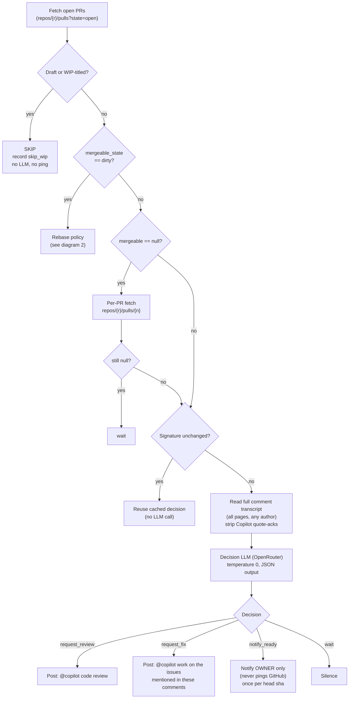
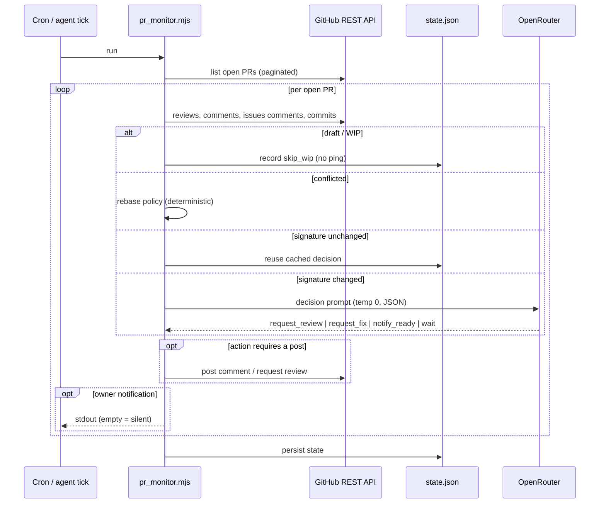
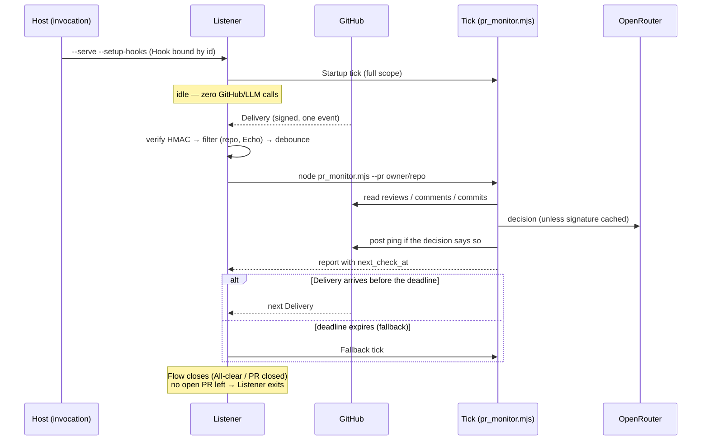

# Copilot Review — Smart (LLM-decided) watchdog

A PR watchdog that drives open PRs toward a Copilot clean bill of health without
spamming: it pings `@copilot code review` only when a review is actually useful,
asks Copilot to resolve merge conflicts when needed, and tells the **owner** when
a PR is ready for human review — staying silent the rest of the time.

Webhook-first: a GitHub delivery wakes a tick scoped to the affected PR and the
fallback is an armed Expectation, not a schedule (see
[4. Webhook mode](#4-webhook-mode)). Cron remains the alternate mode for Hosts
without a public endpoint.

The agent-facing instructions live in [`SKILL.md`](./SKILL.md); the reference
implementations are [`pr_monitor.mjs`](./pr_monitor.mjs) (the tick: Node >= 18,
`gh` CLI, OpenRouter for the decision LLM) and
[`pr_monitor_webhook.mjs`](./pr_monitor_webhook.mjs) (the Listener: `node:http`,
no dependencies). This README is the human-readable picture of what the loop
does.

## Quick start

Cron/one-shot mode (alternate):

```bash
DRY_RUN=1 PR_MONITOR_REPOS="your-org/your-repo" node pr_monitor.mjs
```

Webhook mode (primary): register the Hook, then serve.

```bash
PR_MONITOR_REPOS="your-org/your-repo" \
PR_MONITOR_WEBHOOK_SECRET="$(openssl rand -hex 32)" \
PR_MONITOR_PUBLIC_URL="https://your-public-host" \
node pr_monitor_webhook.mjs --serve --setup-hooks
```

`--daemon` detaches it, `--status` reports pid + health, `--stop` shuts it down;
`--tunnel ngrok|cloudflared` brings up a tunnel for development. Deploy files
and ingress recipes are in [`resources/deploy/`](./resources/deploy/).

Agent-facing one-shots can also use CLI scope flags plus JSON reporting:

```bash
DRY_RUN=1 node pr_monitor.mjs --repo your-org/your-repo --json-report
DRY_RUN=1 node pr_monitor.mjs --pr your-org/your-repo#123 --json-report
```

Other env: `PR_MONITOR_STATE_PATH`, `PR_MONITOR_MODEL`, `OPENROUTER_API_KEY`,
`PR_MONITOR_PR`, `PR_MONITOR_REPORT=jsonl`.

Fixture harness:

```bash
npm run harness:copilot-review-smart -- first-tick-wait
npm run harness:copilot-review-smart -- loop-repo-live-scope --loop
```

The harness runs the real `pr_monitor.mjs` process with a fake `gh` on `PATH`,
frozen LLM responses, and a temporary state file so one-shot and loop behavior
stay deterministic and network-free. The webhook tests use the same fake `gh`
for an end-to-end signed-delivery → ping check.

## 1. Main decision flow (per open PR)

Deterministic gates first, LLM last — the LLM call is the only expensive step,
so idle ticks hit GitHub APIs only.

Implementation seam: deterministic gates and the LLM boundary live in
`decision.mjs`, where the LLM dependency is injectable for network-free tests.



## 2. Rebase policy (dirty PRs — HARD deterministic gate)

Evaluated **before** the LLM; the LLM never picks `request_rebase`.


## 3. Sequence: one tick of the loop

Where the money is spent (the LLM call) and where it is avoided (the
signature cache).



## 4. Webhook mode

Event-driven primary mode. A signed GitHub delivery only wakes a tick scoped
to its PR; the decision pipeline below is unchanged. The fallback for a
missing delivery is an **armed Expectation** (`next_check_at`), not a periodic
sweep: with no Expectation the loop is asleep and makes zero GitHub/LLM calls.



- **Listener**: `node:http`, no dependencies; HMAC-verified, repo-filtered,
  Echo-filtered, debounced per PR, one tick at a time; spawns the tick and
  holds no decision logic. `--serve` / `--daemon` / `--stop` / `--status`,
  pid file locking, JSONL logs to stdout.
- **Hook**: permanent per repo, updated by id (a tunnel URL change updates,
  never duplicates); `--setup-hooks [--rotate-secret]`, `--list-hooks`,
  `--teardown`; setup refuses to create a Hook whose public URL cannot answer
  `/healthz`, and `--serve --setup-hooks` verifies success only after GitHub's
  ping Delivery arrives.
- **Expectations**: the tick report carries `next_check_at` per PR; the
  Listener arms it, a Delivery cancels it, expiry runs exactly one Fallback
  tick. Failed ticks re-arm with 1 → 5 → 15 min, then hourly backoff. Pending
  Expectations survive restarts.
- **Lifecycle**: the Listener runs one Startup tick at start (recovering
  deliveries missed while it was down; `PR_MONITOR_STARTUP_TICK=0` disables),
  tracks the Flows it watches, and exits when no open PR is left to watch;
  `--keep-alive` for a supervised always-on Host.
- **Ingress**: external to the skill — `PR_MONITOR_PUBLIC_URL` must be public
  HTTPS (Tailscale Funnel, ngrok, cloudflared, or a reverse proxy). Deploy
  files are platform-agnostic; the agent picks where to run them:
  [`resources/deploy/`](./resources/deploy/).
- **Notifications**: `PR_MONITOR_NOTIFY_CMD` gets JSON on stdin for
  notify-ready / needs-human / escalation, 30s timeout, failures logged only.

Cron stays as the alternate mode for Hosts that cannot expose a public
endpoint: everything above section 4 applies unchanged.

## Anti-spam guardrails (the core)

- **WIP/active-work guard**: drafts and WIP/[WIP]/DNM titles skip the loop; a
  branch whose last commit is < 3h old holds all pings (`notify_ready` exempt).
- **Merge-conflict gate**: never review a conflicted PR — the rebase policy
  above handles it deterministically.
- **Signature cache**: hash of head sha + Copilot feedback timestamps + review
  state + unresolved count + approved flag + mergeable + transcript digest.
  Unchanged ⇒ cached decision, no LLM call (idle tick ≈ 2.7s). Any new
  comment invalidates it.
- **Throttles**: 12h same-sha ping interval for review/fix requests; 6h
  same-sha interval for conflict-resolution pings; 6h cooldown after the newest
  Copilot review; 6h rebase-retry window; 3 rebase pings per sha, then owner
  escalation + weekly retry.
- **`seen_ready` shas**: `notify_ready` fires once per head sha.
- **Transcript-first**: never re-ask what a human already asked; Copilot acks
  (quote-replies) never count as new requests or progress.
- **Silent output**: nothing to report ⇒ print nothing in cron mode. Agent-facing
  runs opt into one JSON line per PR plus one overall line.

See [`SKILL.md`](./SKILL.md) for pitfalls, cron setup, and the full action
table.
