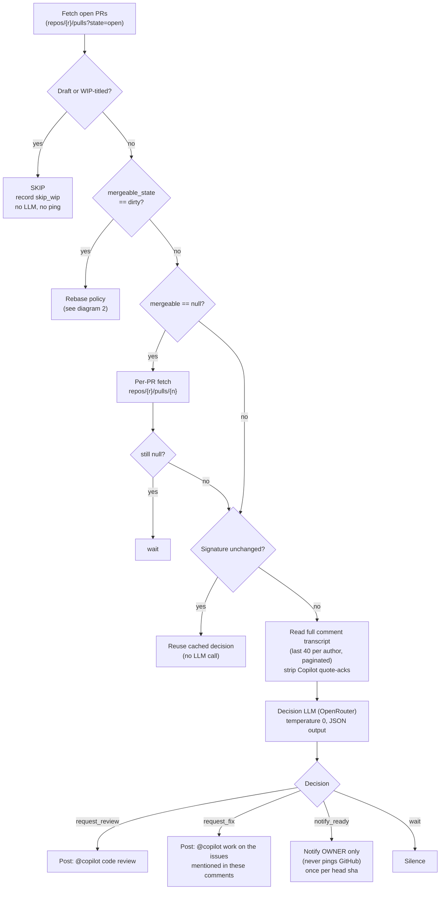
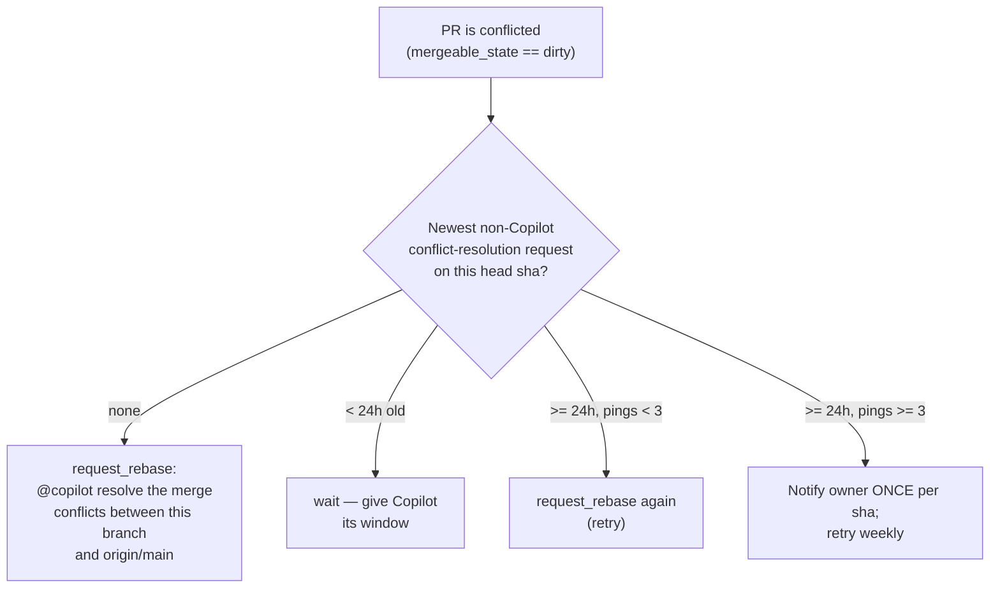
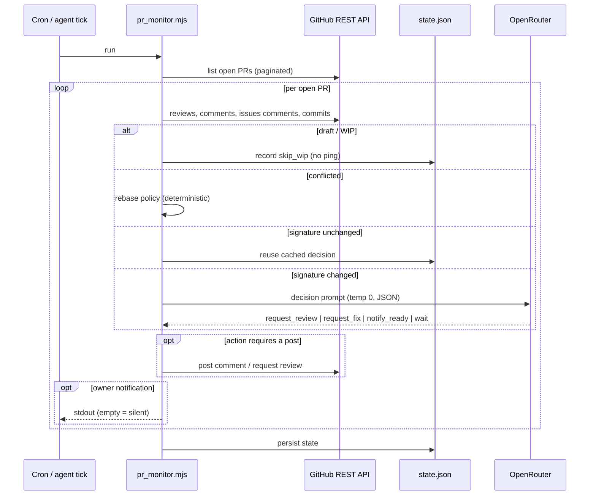

# Copilot Review — Smart (LLM-decided) watchdog

A cron/agent loop that drives open PRs toward a Copilot clean bill of health
without spamming: it pings `@copilot code review` only when a review is
actually useful, asks Copilot to resolve merge conflicts when needed, and
tells the **owner** when a PR is ready for human review — staying silent the
rest of the time.

The agent-facing instructions live in [`SKILL.md`](./SKILL.md); the reference
implementation is [`pr_monitor.mjs`](./pr_monitor.mjs) (Node >= 18, `gh` CLI,
OpenRouter for the decision LLM). This README is the human-readable picture of
what the loop does.

## Quick start

```bash
DRY_RUN=1 PR_MONITOR_REPOS="your-org/your-repo" node pr_monitor.mjs
```

Other env: `PR_MONITOR_STATE_PATH`, `PR_MONITOR_MODEL`, `OPENROUTER_API_KEY`.

## 1. Main decision flow (per open PR)

Deterministic gates first, LLM last — the LLM call is the only expensive step,
so idle ticks hit GitHub APIs only.



## 2. Rebase policy (dirty PRs — HARD deterministic gate)

Evaluated **before** the LLM; the LLM never picks `request_rebase`.



## 3. Sequence: one tick of the loop

Where the money is spent (the LLM call) and where it is avoided (the
signature cache).



## Anti-spam guardrails (the core)

- **WIP/active-work guard**: drafts and WIP/[WIP]/DNM titles skip the loop; a
  branch whose last commit is < 3h old holds all pings (`notify_ready` exempt).
- **Merge-conflict gate**: never review a conflicted PR — the rebase policy
  above handles it deterministically.
- **Signature cache**: hash of head sha + Copilot feedback timestamps + review
  state + unresolved count + approved flag + mergeable + transcript digest.
  Unchanged ⇒ cached decision, no LLM call (idle tick ≈ 2.7s). Any new
  comment invalidates it.
- **Throttles**: 12h same-sha ping interval; 6h cooldown after the newest
  Copilot review; 24h rebase-retry window; 3 rebase pings per sha, then owner
  escalation + weekly retry.
- **`seen_ready` shas**: `notify_ready` fires once per head sha.
- **Transcript-first**: never re-ask what a human already asked; Copilot acks
  (quote-replies) never count as new requests or progress.
- **Silent output**: nothing to report ⇒ print nothing.

See [`SKILL.md`](./SKILL.md) for pitfalls, cron setup, and the full action
table.
